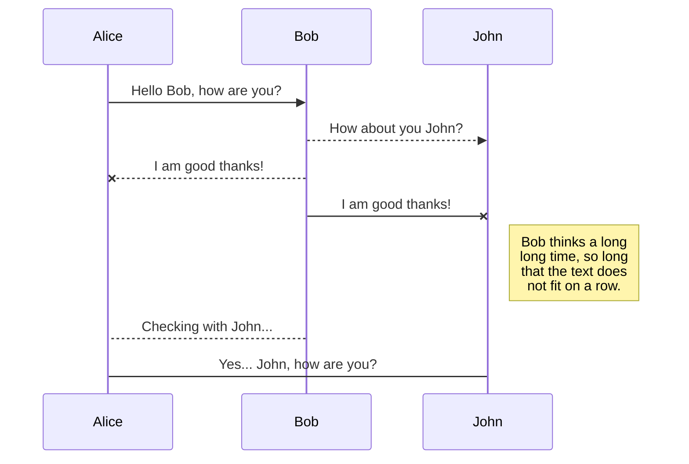

## 简介

这是项目包含一个 ppt 制作后台，一个 PPT 市场前台。

## 后台

- 支持用户注册和登录
- 支持用户创建 MD 文件
- 支持 MD 文件预览为 PPT
- 支持 PPT 创建、编辑、删除、开发

## 前台

- 列出开放的所有 PPT
- 显示 PPT 的浏览量

## 愿景

reveal,nodeppt 这个 HTML 呈现框架可以很好的制作幻灯片。但是使用比较繁琐还需要部署。此项目让创建、部署、分享 ppt 变的简单。

fork 月影的 matrix 和 nodeppt。加入了用户注册和浏览率记录。同时 thinkjs 升级到了 3.0
希望此项目可以帮助公司建立自己内部的 ppt 分享平台

使用方式请参与[nodeppt](https://github.com/ksky521/nodeppt)

## Install dependencies

```
npm install
```

## Start server

```
npm start
```

## Deploy with pm2

Use pm2 to deploy app on production enviroment.

```
pm2 startOrReload pm2.json
```

### 基本语法

整个 markdown 文件分为两部分，第一部分是写在最前面的**配置**，然后是使用`<slide>`隔开的每页幻灯片内容。

### 配置

nodeppt 的配置是直接写在 md 文件顶部的，采用 yaml 语法，例如下面配置：

```yaml
title: nodeppt markdown 演示
speaker: 三水清
url: https://github.com/ksky521/nodeppt
js:
  - https://www.echartsjs.com/asset/theme/shine.js
prismTheme: solarizedlight
plugins:
  - echarts
  - mermaid
  - katex
```

- title: 演讲主题
- speaker：演讲者
- url：地址
- js：js 文件数组，放到 body 之前
- css：css 文件数组，放到头部
- prismTheme：prism 配色，取值范围 `['dark', 'coy', 'funky', 'okaidia', 'tomorrow', 'solarizedlight', 'twilight']`
- plugins：目前支持 [echarts](https://echarts.baidu.com/)，[mermaid](https://mermaidjs.github.io/)和 [katex](https://katex.org) 三个插件

#### 插件

目前 nodeppt 支持 [图表 echarts](https://echarts.baidu.com/)，[流程图 mermaid](https://mermaidjs.github.io/)，[数学符号 KaTeX](https://katex.org) 三个插件。

#### echarts

echarts 主题配色可以直接在`yaml`配置的 js 中引入。echarts 采用`fence`语法，如下：

```echarts
{
    xAxis: {
        type: 'category',
        data: ['Mon', 'Tue', 'Wed', 'Thu', 'Fri', 'Sat', 'Sun']
    },
    yAxis: {
        type: 'value'
    },
    series: [{
        data: [820, 932, 901, 934, 1290, 1330, 1320],
        type: 'line'
    }]
}
```

详见[site/echarts.md](./site/echarts.md)

#### mermaid

mermaid 主题配色可以直接在`yaml`配置的 js 中引入。mermaid 采用`fence`语法，如下：



详见[site/mermaid.md](./site/mermaid.md)

#### ketex

参考：[markdown-it-katex](https://www.npmjs.com/package/markdown-it-katex)语法

### `<slide>` 语法

nodeppt 会根据`<slide>`对整个 markdown 文件进行拆分，拆成单页的幻灯片内容。`<slide>` 标签支持下面标签：

- class/style 等：正常的 class 类，可以通过这个控制居中（aligncenter），内容位置，背景色等
- image：背景图片，基本语法 `image="img_url"`
- video：背景视频，基本语法 `video="video_src1,video_src2"`
- :class：wrap 的 class，下面详解

每个 slide 会解析成下面的 html 结构：

```html
<section class="slide" attrs...>
  <div class="wrap" wrap="true">// 具体 markdown 渲染的内容</div>
</section>
```

其中`<slide>` 的`class`等会被解析到 `<section>`标签上面，而`:class`则被解析到`div.wrap`上面，例如：

```html
<slide :class="size-50" class="bg-primary"></slide>
```

output 为：

```html
<section class="slide bg-primary">
  <div class="wrap size-50" wrap="true">// 具体 markdown 渲染的内容</div>
</section>
```

#### 背景：图片

`<slide>`的`image` 会被解析成背景大图，常见的支持方式有：

```md
<slide image="https://source.unsplash.com/UJbHNoVPZW0/">

# 这是一个普通的背景图

<slide image="https://source.unsplash.com/UJbHNoVPZW0/ .dark">

# 这张背景图会在图片上面蒙一层偏黑色的透明层

<slide image="https://source.unsplash.com/UJbHNoVPZW0/ .light">

# 这张背景图会在图片上面蒙一层偏白色的透明层

<slide class="bg-black aligncenter" image="https://source.unsplash.com/n9WPPWiPPJw/ .anim">

# 这张背景图会缓慢动
```

详见[site/background.md](./site/background.md)和[在线演示](https://js8.in/nodeppt/background.html)

### 样式

样式太多，具体详见[site/classes.md](./site/classes.md)和[在线演示](https://js8.in/nodeppt/classes.html)

### 布局

nodeppt 这次使用`webslides`的布局，支持丰富的布局，实在太多了，直接看文档[site/layout.md](./site/layout.md)和[在线演示](https://js8.in/nodeppt/layout.html)

### attribute

参考[markdown-it-attrs](https://www.npmjs.com/package/markdown-it-attrs)，支持了`attribute`，修改增加多 class 支持等功能。

其中：`..class`会往上一级节点添加 class，支持`{.class1.class2}`这种多 class 的语法。用法举例：

```markdown
# header {.style-me.class2}

paragraph {data-toggle=modal}
```

Output:

```html
<h1 class="style-me class2">header</h1>
<p data-toggle="modal">paragraph</p>
```

```markdown
Use the css-module green on this paragraph. {.text-intro}
```

Output:

```html
<p class="text-intro">Use the css-module green on this paragraph.</p>
```

```markdown
- list item **bold** {.red}
```

Output:

```html
<ul>
  <li class="red">list item <strong>bold</strong></li>
</ul>
```

```markdown
- list item **bold**
  {.red}
```

Output:

```html
<ul class="red">
  <li>list item <strong>bold</strong></li>
</ul>
```

### image 增强

对于 image ，支持外面包裹一层的写法，具体语法 `!`，例如：

```markdown
!
```

Output：

```html

```

```markdown
!
```

Output:

```html
<figure>
  
</figure>
```

### button

nodeppt 的 button 是类似`link`语法的，支持蓝色、圆角、空心和 icon 版本的 button：

```markdown
[普通按钮](){.button} [圆角普通按钮](){.button.radius}

[空心](){.button.ghost} [:fa-github: 前面带 icon](){.button}
```

### Icon：FontAwesome

nodeppt 的 icon 支持 [FontAwesome](https://fontawesome.com/)
语法：

- `:fa-xxx:` → `<i class="fa fa-xxx"></i>`
- `:~fa-xxx:~` → `<span><i class="fa fa-xxx"></i></span>`
- `::fa-xxx::` → 块级`<i class="fa fa-xxx"></i>`，即不会被`p`包裹

### span

代码修改自[markdown-it-span](https://github.com/pnewell/markdown-it-span/)，支持 `attr`语法，基本用法：

```md
:span:
:span: {.text-span}
```

### 动效

nodeppt 一如既往的支持动效，2.0 版本支持动效主要是页面内的动效。

支持动效包括：

- fadeIn
- zoomIn
- rollIn
- moveIn
- fadeInUp
- slow

在需要支持的动效父节点添加`.build`或者在具体的某个元素上添加`.tobuild+动效 class`即可。

按照惯例，nodeppt 还支持`animate.css`的动效哦~

详细查看文件：[site/animation.md](./site/animation.md)和[在线演示](https://js8.in/nodeppt/animation.html)

### 使用强大的`:::`完成复杂布局

`:::`语法是扩展了 [markdown-it-container](https://www.npmjs.com/package/markdown-it-container) 语法，默认是任意 tag，例如

```markdown
:::div {.content-left}

## title

:::
```

Output：

```html
<div class="content-left"><h2>title</h2></div>
```

还支持，`tag` 嵌套，除此之外，支持的组件包括：

- card：卡片，一边是图片，一边是内容
- column：column 多栏布局
- shadowbox：带阴影的盒子
- steps：步骤组件
- cta：
- gallery：图片
- flexblock：flex block 布局，支持多个子类型
- note: 演讲注释

基本语法是：

```markdown
:::TYPE {.attrs}

## 第一部分

使用 hr 标签隔开

---

## 第二部分

这里的内容也是哦

:::
```

<h2 align="center">打印？导出 pdf？</h2>

chrome 浏览器，直接在第一页 `command+P/ctrl+P` 即可

<h2 align="center">高级玩法</h2>

<h2 align="center">Thanks</h2>

- [WebSlides](https://github.com/webslides/WebSlides)
- [markdown-it](https://github.com/markdown-it/markdown-it)
- [posthtml](https://github.com/posthtml/posthtml)
- [webpack](https://github.com/webpack/webpack)
- [vue-cli](https://github.com/vuejs/vue-cli)
- [nodeppt](https://github.com/ksky521/nodeppt)
